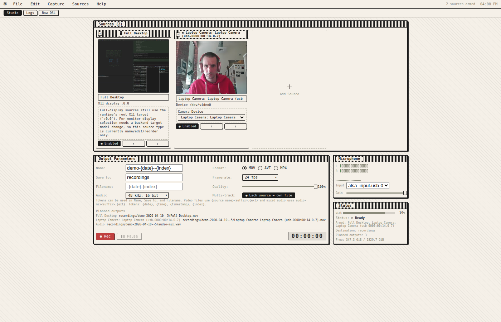

# Screencast Studio

A CLI-first screencast recording studio for Linux with a web-based interface. Capture multiple video sources simultaneously—desktop, cameras, windows—with synchronized audio mixing and multiple output options.



## Features

- **Multi-Source Recording** — Capture desktop, camera, and window sources simultaneously
- **Web-Based Studio UI** — Configure and monitor recordings with live previews
- **YAML Configuration DSL** — Define recording setups as code, version them in git
- **Synchronized Audio** — Mix multiple audio inputs with per-source gain control
- **Multiple Output Formats** — MOV, AVI, MP4 with quality settings
- **Per-Source Files** — Each source gets its own file plus a mixed audio track
- **Retro Terminal Aesthetic** — Distraction-free interface

## Quick Start

### Installation

```bash
# Build from source
go generate ./...
go build -o screencast-studio ./cmd/screencast-studio

# Or use the Makefile
make build
```

### Launch the Studio

```bash
# Start the web UI (opens on http://localhost:7777)
./screencast-studio serve
```

### Create a Recording Setup

Create a `setup.yaml` file:

```yaml
schema: "recorder.config/v1"
session_id: "demo-{date}--{index}"

destination_templates:
  audio_mix: "recordings/{session_id}/audio-mix.{ext}"
  per_source: "recordings/{session_id}/{source_name}.{ext}"

audio_defaults:
  output:
    codec: "pcm_s16le"
    sample_rate_hz: 48000
    channels: 2

video_sources:
  - id: "desktop-1"
    name: "Full Desktop"
    type: "display"
    enabled: true
    target:
      display: ":0.0"
    settings:
      capture:
        fps: 24
        cursor: true
      output:
        container: "mov"
        video_codec: "h264"
        quality: 100
    destination_template: "per_source"

  - id: "camera-1"
    name: "Webcam"
    type: "camera"
    enabled: true
    target:
      device: "/dev/video0"
    settings:
      capture:
        fps: 30
        size: "1280x720"
      output:
        container: "mov"
        video_codec: "h264"
        quality: 80
    destination_template: "per_source"

audio_sources:
  - id: "mic-1"
    name: "USB Microphone"
    device: "alsa_input.usb-0c76_USB_PnP_Audio_Device-00.mono-fallback"
    enabled: true
    settings:
      gain: 1
      noise_gate: true
      denoise: true
```

### Record via CLI

```bash
# Record using a setup file
./screencast-studio record -f setup.yaml

# Compile and preview without recording
./screencast-studio setup compile -f setup.yaml
```

## Commands

| Command | Description |
|---------|-------------|
| `serve` | Launch the web UI studio |
| `record` | Record from a setup file or DSL |
| `discovery` | List available capture sources |
| `setup` | Work with setup files |

### Discovery Commands

```bash
# List all capture sources
./screencast-studio discovery list

# List specific source types
./screencast-studio discovery list --kind display
./screencast-studio discovery list --kind camera
./screencast-studio discovery list --kind audio
./screencast-studio discovery list --kind window

# Take a snapshot of all available sources
./screencast-studio discovery snapshot
```

## Architecture

```
┌─────────────────────────────────────────┐
│           Web UI (React/Redux)          │
│         http://localhost:7777             │
└─────────────────┬─────────────────────────┘
                  │ WebSocket/HTTP
┌─────────────────▼─────────────────────────┐
│           Go Backend Server             │
│  ┌──────────────┬──────────────┐        │
│  │   Web API    │   Recorder   │        │
│  └──────────────┴──────────────┘        │
│         │              │                │
│  ┌──────▼──────┐ ┌─────▼─────┐         │
│  │  Discovery  │ │  ffmpeg   │         │
│  └─────────────┘ └───────────┘         │
└─────────────────────────────────────────┘
```

### Tech Stack

- **Backend**: Go 1.25+ with Cobra CLI framework
- **Frontend**: React 18 + TypeScript + Vite + Redux Toolkit
- **Streaming**: WebSocket for live state updates
- **Video Pipeline**: FFmpeg for capture and encoding
- **Communication**: Protocol Buffers over WebSocket
- **Styling**: Retro terminal-inspired design

## Project Structure

```
├── cmd/screencast-studio/    # Main entry point
├── pkg/
│   ├── app/                    # Application core
│   ├── cli/                    # CLI commands
│   ├── discovery/              # Source discovery (X11, V4L2, PulseAudio)
│   ├── dsl/                    # YAML configuration DSL
│   └── recording/              # FFmpeg recording engine
├── ui/                         # React web interface
│   ├── src/
│   └── storybook-static/       # Component documentation
├── proto/                      # Protocol Buffer schemas
└── recordings/                 # Default output directory
```

## Development

### Prerequisites

- Go 1.25+
- Node.js 20+ with pnpm
- FFmpeg
- Linux with X11

### Build UI

```bash
cd ui
pnpm install
pnpm build
```

Or use the Go generate command:

```bash
go generate ./...
```

### Run Tests

```bash
make test
```

### Linting

```bash
make lint
```

## Configuration

### Filename Templates

Use tokens in destination templates:

| Token | Description |
|-------|-------------|
| `{date}` | Current date (YYYY-MM-DD) |
| `{time}` | Current time (HH-MM-SS) |
| `{timestamp}` | Unix timestamp |
| `{index}` | Auto-incrementing session index |
| `{session_id}` | Full session ID |
| `{source_name}` | Source name |

### Output Formats

| Format | Container | Codecs |
|--------|-----------|--------|
| MOV | QuickTime | H.264, PCM audio |
| AVI | AVI | H.264, PCM audio |
| MP4 | MPEG-4 | H.264, AAC audio |

## Requirements

- Linux with X11 display server
- FFmpeg 5.0+
- For camera capture: Video4Linux2 (V4L2) devices
- For audio: PulseAudio or PipeWire

## Contributing

Contributions are welcome! This project uses:

- Conventional commit messages
- GitHub Actions for CI/CD
- GoReleaser for releases

## License

MIT License — see [LICENSE](LICENSE) for details.

---

Built with Go, React, and FFmpeg.
