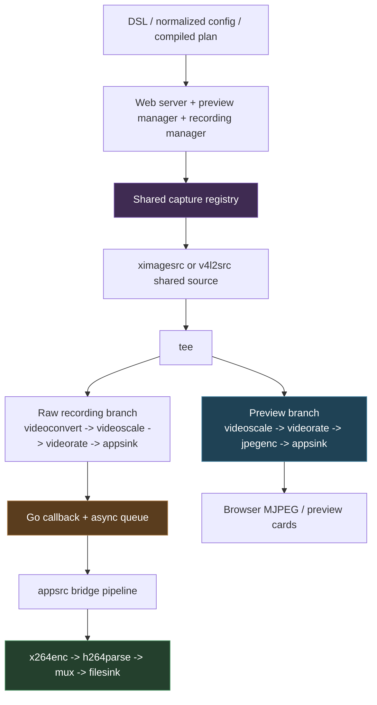

# Screencast Studio - GStreamer Setup, Performance, and Region Debugging Report

This note is a detailed project report about the current GStreamer-based media runtime in `screencast-studio`, with an emphasis on the parts that became important during real manual testing: how the shared preview and recording setup actually works, why recording CPU jumps so sharply, and how the bottom-half / right-half region debugging unfolded from “this looks like the full display” into a concrete backend capture fix plus a separate frontend framing fix.

It should be read as a continuation of [[PROJ - Screencast Studio - Architecture and Runtime Deep Dive]] and [[PROJ - Screencast Studio - GStreamer Migration and Media Runtime Intern Guide]]. Those earlier notes explain the original architecture and the migration journey. This note focuses on the current GStreamer runtime shape, the practical debugging lessons, and the engineering constraints exposed by live use.

> [!summary]
> 1. Screencast Studio now runs on a **shared GStreamer capture model** for preview and recording rather than the earlier preview-suspend handoff model.
> 2. The current recording CPU spike is **real** and appears to come from both the **x264 encoder settings** and the **shared raw-consumer → Go → appsrc recording bridge**.
> 3. The bottom-half / right-half region bug was not just a UI issue: on this machine, `ximagesrc` coordinate capture could produce the right dimensions while still showing the wrong full-display content.
> 4. The eventual region fix was a two-part story: **backend full-root capture + `videocrop`**, and then a separate **frontend aspect-ratio / `object-fit` fix** so the UI stopped visually hiding the real geometry.

## Why this report exists

This report exists because the project is now in a phase where the broad migration to GStreamer is no longer the only interesting story. The important questions have become much more concrete:

- What exactly is the current GStreamer runtime topology?
- Where is CPU actually being spent during recording?
- Which bugs were architectural, and which ones were only presentation bugs?
- What should a future maintainer be suspicious of when preview and recording “mostly work” but still behave strangely under real use?

That is a different kind of note than the earlier migration guide. This one is closer to a practical engineering report: it explains the current setup, the failures that mattered in manual testing, the measurements that made the performance problem concrete, and the lessons that now shape the next optimization/debugging steps.

## Current project status

The repository at `/home/manuel/code/wesen/2026-04-09--screencast-studio` is now effectively a GStreamer-first project. The active FFmpeg runtime path was removed from the main runtime. Preview and recording are both GStreamer-based, and the old preview suspend/restore model has been replaced by a shared capture architecture.

The GStreamer runtime is no longer just a prototype. It already supports:

- shared preview capture,
- recording without preview suspension,
- screenshot capture from preview sessions,
- audio effects during recording,
- websocket audio meter plumbing,
- region/window preview capture using full-root X11 capture plus `videocrop`,
- source-aware preview quality tuning,
- and a growing set of standalone benchmark/debugging scripts under the ticket trees.

At the same time, real manual testing revealed follow-on bugs and runtime costs that are typical of media systems once the broad architecture starts working: the remaining problems are no longer “can it record at all?” but “does it crop the right pixels?”, “does the preview stay live under recording load?”, and “is the CPU cost acceptable for real use?”

## Project shape

At a high level, the project now has six relevant layers:

1. **DSL and planning**
   - user setup description
   - normalization
   - compiled plan
2. **Application and web layer**
   - recording/session orchestration
   - preview lifecycle
   - websocket events
3. **Shared GStreamer capture layer**
   - shared source registry
   - tee-backed preview consumers
   - tee-backed raw recording consumers
4. **Preview branch**
   - scaling, framerate limiting, JPEG encoding, appsink delivery to Go
5. **Recording branch**
   - raw appsink branch
   - Go bridge / `appsrc`
   - x264 encode and muxing
6. **UI presentation layer**
   - source cards
   - aspect-ratio handling
   - preview card behavior



## Current GStreamer setup

The most important current code paths are:

- `pkg/media/gst/shared_video.go`
  - shared source registry
  - preview branch construction
  - raw consumer branch construction
- `pkg/media/gst/preview.go`
  - source construction for display/window/region/camera
  - region/window `videocrop` path
- `pkg/media/gst/shared_video_recording_bridge.go`
  - experimental shared recorder that is now the live video recording path
  - `appsink -> Go -> appsrc` bridge
- `pkg/media/gst/recording.go`
  - recording runtime orchestration
- `internal/web/preview_manager.go`
  - preview lifecycle and reuse behavior
- `ui/src/components/preview/PreviewStream.tsx`
  - preview aspect-ratio behavior in the browser
- `ui/src/pages/StudioPage.tsx`
  - source-aware preview aspect ratio computation

### Source types and capture primitives

For X11 display, window, and region sources, the GStreamer runtime currently uses `ximagesrc`. For region and window capture, the important design change is that the runtime now treats `ximagesrc` as a **full-root capture source**, not a correctness-trustworthy implicit region cropper.

The current mental model is:

- **display**: capture the full root display directly
- **region**: capture full root, then apply explicit `videocrop`
- **window**: resolve the absolute window rect, capture full root, then apply explicit `videocrop`
- **camera**: use `v4l2src` and normalize caps as needed

That is more expensive than “ask `ximagesrc` for just the region,” but it is more trustworthy on this machine.

### Shared preview architecture

The preview runtime uses a shared source registry so multiple previews do not each create independent capture pipelines for the same display/region/camera source.

The shared source emits frames into a `tee`, and preview consumers attach as individual branches. Each preview branch does its own lightweight normalization before JPEG-encoding frames for the web layer:

- queue (leaky)
- `videoscale`
- explicit scale caps
- `videorate`
- explicit preview FPS caps
- `jpegenc`
- `appsink`

The preview branch is intentionally tuned more for responsiveness than for perfect fidelity. That is why it uses bounded queues and dropping behavior, and why preview quality became its own tuning bug rather than being “whatever the source happens to emit.”

### Shared recording architecture

The current recording model for video is more complicated.

Instead of attaching an encoder branch directly to the shared source tee, the code currently does this:

1. attach a **raw consumer** branch to the shared source,
2. normalize frames to a specific raw format/caps,
3. deliver them to `appsink`,
4. handle them in Go,
5. push them into a second pipeline through `appsrc`,
6. encode and mux there.

That path solved a real architecture problem: it allowed preview continuity during recording and avoided the earlier shared-pipeline EOS/finalization issues. But it introduced a cost: it is not a zero-overhead topology.

## Implementation details

### Shared preview branch

The preview branch is built in `pkg/media/gst/shared_video.go` and currently looks conceptually like this:

```text
shared source
  -> tee
  -> queue(leaky)
  -> videoscale
  -> caps(width,height,pixel-aspect-ratio=1/1)
  -> videorate
  -> caps(framerate=N/1)
  -> jpegenc(quality=...)
  -> appsink(image/jpeg)
  -> Go preview manager / HTTP MJPEG
```

That design does two important things:

1. it makes preview behavior more stable and predictable than handing raw source frames directly to the web layer,
2. it isolates preview fidelity from recording fidelity, which matters because browser preview and archival recording are not the same workload.

The preview branch is also where the webcam-quality regression lived. Earlier hard-coded preview settings were too aggressive and made camera previews look compressed and low quality. That was later improved with source-aware preview profiles.

### Shared recording bridge

The current recording bridge path is the main performance hotspot and the most important thing to understand.

In `pkg/media/gst/shared_video_recording_bridge.go`, the rough shape is:

```text
shared source
  -> tee
  -> queue(leaky)
  -> videoconvert
  -> videoscale
  -> videorate
  -> caps(video/x-raw,format=I420,width=...,height=...,framerate=...)
  -> appsink
  -> Go callback
  -> async buffer queue
  -> appsrc in second pipeline
  -> videoconvert
  -> x264enc
  -> h264parse
  -> mp4mux/qtmux
  -> filesink
```

Pseudocode for the important control flow looks like this:

```go
on appsink sample:
    sample := PullSample()
    buffer := sample.GetBuffer()
    bridge := ensureBridge(sample.GetCaps())
    copied := buffer.Copy()
    enqueue(copied)

sample pump goroutine:
    for buffer := range sampleCh {
        set pts/duration
        appsrc.PushBuffer(buffer)
    }

stop:
    detach raw consumer
    close sample queue
    wait for worker
    appsrc.EndStream()
    wait for EOS from recorder pipeline
```

This design explains both the success and the cost.

Why it worked:

- preview no longer has to be suspended to record,
- the encoder and muxer finalize in their own pipeline,
- preview continuity survives recorder stop,
- EOS/finalization is easier to reason about than trying to stop only one tee branch inside a shared muxing graph.

Why it is expensive:

- the raw branch has its own normalization chain,
- every frame crosses into Go through `appsink`,
- Go manages queueing/scheduling,
- every frame is pushed back into GStreamer through `appsrc`,
- the second pipeline still does a `videoconvert` before x264,
- and the encode itself is already expensive even before adding bridge overhead.

## The current performance problem

The practical user complaint was simple: starting recording makes CPU jump very high.

That concern turned out to be real. Standalone measurement scripts were added under the SCS-0014 ticket to separate different sources of cost instead of guessing from the live server.

### Saved measurement harnesses

Standalone performance scripts live under:

- `/home/manuel/code/wesen/2026-04-09--screencast-studio/ttmp/2026/04/13/SCS-0014--fix-preview-regressions-in-screencast-studio-web-ui/scripts/06-gst-recording-performance-matrix/`
- `/home/manuel/code/wesen/2026-04-09--screencast-studio/ttmp/2026/04/13/SCS-0014--fix-preview-regressions-in-screencast-studio-web-ui/scripts/07-go-shared-recording-performance-matrix/`
- `/home/manuel/code/wesen/2026-04-09--screencast-studio/ttmp/2026/04/13/SCS-0014--fix-preview-regressions-in-screencast-studio-web-ui/scripts/08-recording-performance-measurements-summary.md`

Measured test shape:

- display `:0`
- root geometry `2880x1920`
- measured region `0,960,2880,960` (bottom half)
- recording FPS `24`

### Performance results

Pure direct GStreamer (`gst-launch-1.0`) measurements:

- capture to `fakesink`: **23.17% avg CPU**
- preview-like JPEG pipeline: **8.67% avg CPU**
- direct x264 record with current preset (`speed-preset=3`): **86.50% avg CPU**
- direct x264 record with faster preset (`speed-preset=1`): **49.83% avg CPU**

Current shared Go bridge measurements:

- preview only: **10.67% avg CPU**
- recorder only: **139.57% avg CPU**
- preview + recorder: **151.62% avg CPU**

### Interpretation

These numbers suggest three important things.

#### 1. x264 is already expensive by itself

Even without the shared bridge path, a direct large-region x264 recording at the current settings is expensive. So the performance problem is not purely “Go overhead” or purely “our weird architecture.” The encoder settings matter a lot.

#### 2. The bridge adds substantial cost beyond direct recording

The current bridge path is far more expensive than the direct GStreamer encode path. That means the shared raw-consumer → Go → appsrc design is solving a real architecture problem, but it is not free.

#### 3. Preview is not the main cost center

Preview adds some overhead, but the big jump is recording/encoding. That matches intuition and also aligns with the CPU results.

## The bottom-half / right-half debugging story

The region/window debugging became one of the most instructive parts of the current project because the bug initially looked like one thing but turned out to be two different bugs layered on top of each other.

### Symptom

The user selected regions like **bottom half** or **right half**, but the preview still looked like the **full display**. At first glance, this suggested one of several possible causes:

- the UI was constructing the wrong source kind,
- the backend was dropping the region/window rect,
- the preview card was wired to the wrong MJPEG stream,
- or the capture path itself was not actually selecting the requested pixels.

### What turned out to be true

All of the easy explanations were wrong or only partly true.

#### False lead 1: maybe the UI sent the wrong DSL

It did not. The raw DSL and backend logs showed correct `region` / `window` source kinds and real rects.

#### False lead 2: maybe the preview cards were wired to the wrong preview ID

They were not. Distinct preview IDs and distinct screenshot endpoints existed.

#### Partial truth 3: preview scaling and framing were misleading

This *was* a real bug, but not the root cause of the backend capture bug.

On the backend, the shared preview branch initially had weak aspect-ratio handling, which made screenshots look distorted. On the frontend, the preview cards were also rendered inside fixed `4/3` frames with `object-fit: cover`, which visually hid the true geometry of the region captures.

So there really were presentation bugs, but they were not the whole story.

### The decisive backend experiment

The decisive step was to test `ximagesrc` directly outside the app.

Two kinds of standalone capture were compared:

1. **direct `ximagesrc` coordinate capture** using `startx/starty/endx/endy`
2. **full-root capture + `videocrop`**

The important result was surprising but clear:

- direct coordinate capture could produce the **requested dimensions** while still showing the **wrong full-display content squeezed into those dimensions**
- full-root capture plus `videocrop` produced a **true crop**

That changed the fix direction entirely.

### Backend fix

The fix was to stop trusting `ximagesrc` coordinate cropping for correctness-sensitive region/window capture.

The runtime now:

1. resolves root display geometry,
2. captures the full root,
3. translates the selected rect into `videocrop` margins,
4. crops explicitly in the pipeline.

Conceptually:

```text
ximagesrc(full root)
  -> videocrop(left, top, right, bottom)
  -> preview/recording branches
```

Pseudocode for the crop conversion is roughly:

```go
rootW, rootH := RootGeometry(display)
rect := source.Target.Rect
left   := max(rect.X, 0)
top    := max(rect.Y, 0)
right  := max(rootW - (rect.X + rect.W), 0)
bottom := max(rootH - (rect.Y + rect.H), 0)
```

### Frontend fix

After the backend crop fix, another issue remained: different region captures still *looked* too similar in the browser because the preview cards were rendered in the same fixed aspect-ratio box.

That turned out to be a separate frontend presentation bug:

- the preview container used a fixed `4/3` aspect ratio,
- the image used `object-fit: cover`,
- so cards could visually hide the real geometry of a tall or wide region.

The UI fix was to:

- compute a source-aware `previewAspectRatio`,
- let the card use the real aspect ratio,
- switch from `cover` to `contain`.

That change was important because it restored an honest visual contract: if a source is a thin horizontal strip or a tall vertical right-half region, the preview card should actually look like that.

## Why the bottom-half / right-half bug mattered so much

This bug was bigger than a cosmetic problem.

It exposed a durable engineering lesson about media systems: **correct dimensions are not the same as correct content**. A frame can have the “right” width and height while still showing the wrong pixels.

That matters because engineers often over-trust geometry logs or `ffprobe` output. In this case, dimensions alone were not enough. The debugging needed:

- UI inspection,
- backend logs,
- direct screenshot pulls,
- standalone GStreamer experiments,
- and finally a clear separation between backend pixel-selection correctness and frontend presentation correctness.

## Current likely causes of remaining performance pain

The current performance story looks like this.

### Most likely cause 1: x264 preset is too expensive for the tested shape

The current bridge encoder uses:

- `bitrate=2500`
- `bframes=0`
- `tune=zerolatency`
- `speed-preset=3`

The standalone direct encode benchmark suggests that this preset choice alone is expensive for a `2880x960 @ 24 fps` region.

### Most likely cause 2: bridge topology adds significant extra cost

The measured difference between direct recording and the shared bridge path strongly suggests that the bridge is paying for:

- extra normalization on the raw branch,
- `appsink` callback traffic,
- Go scheduling and buffering,
- `appsrc` push overhead,
- and the fact that frames are now mediated through a second pipeline instead of staying inside one direct encode graph.

### Most likely cause 3: large region size

The tested region is not small. `2880x960` at `24 fps` is still a lot of pixel throughput. That means any expensive transform or encode choice gets amplified.

## Open questions

1. Can the bridge path be made materially cheaper without reintroducing the earlier finalization problems?
2. Is `speed-preset=3` still the right default, or should recording defaults become more obviously speed-oriented?
3. Is the second `videoconvert` in the recorder pipeline always necessary when the raw branch already normalizes to `I420`?
4. Would a lower-overhead tee-to-recorder branch become viable again if we constrain the mux/finalization strategy differently?
5. Should the product expose preview and recording quality/performance modes explicitly instead of burying the tradeoffs in hard-coded pipeline choices?

## Near-term next steps

The most useful next steps now seem to be:

1. add a more detailed benchmark matrix for shared-bridge x264 presets and bitrates,
2. measure smaller regions and lower FPS values,
3. isolate the overhead of `appsink -> Go -> appsrc` more directly,
4. inspect whether the recorder pipeline can avoid redundant conversion work,
5. keep manual UI validation in the loop because these bugs were discovered by real interactive use, not by unit tests.

## Important project docs and ticket artifacts

Main repo:

- `/home/manuel/code/wesen/2026-04-09--screencast-studio`

Ticket docs that shaped this report:

- `/home/manuel/code/wesen/2026-04-09--screencast-studio/ttmp/2026/04/13/SCS-0012--gstreamer-migration-deep-analysis-experiments-and-intern-guide/design-doc/01-gstreamer-migration-analysis-and-intern-guide.md`
- `/home/manuel/code/wesen/2026-04-09--screencast-studio/ttmp/2026/04/13/SCS-0012--gstreamer-migration-deep-analysis-experiments-and-intern-guide/design-doc/02-phase-4-shared-capture-architecture-and-intern-implementation-guide.md`
- `/home/manuel/code/wesen/2026-04-09--screencast-studio/ttmp/2026/04/13/SCS-0012--gstreamer-migration-deep-analysis-experiments-and-intern-guide/design-doc/03-screencast-studio-system-explanation-and-gstreamer-migration-postmortem-for-interns.md`
- `/home/manuel/code/wesen/2026-04-09--screencast-studio/ttmp/2026/04/13/SCS-0014--fix-preview-regressions-in-screencast-studio-web-ui/design-doc/05-window-and-region-preview-full-display-postmortem.md`
- `/home/manuel/code/wesen/2026-04-09--screencast-studio/ttmp/2026/04/13/SCS-0014--fix-preview-regressions-in-screencast-studio-web-ui/scripts/08-recording-performance-measurements-summary.md`

## Project working rule

For this project, the most important working rule now is:

> Treat preview correctness, recording correctness, and recording cost as three separate concerns, and do not assume that fixing one automatically fixes the others.

That rule is what the recent debugging taught most clearly.

- A preview can have the right dimensions and still show the wrong pixels.
- A recording can finalize correctly and still be too expensive to be a good runtime default.
- A UI can be wired correctly and still visually mislead the user if its framing rules are wrong.

The project is now mature enough that those distinctions matter more than broad “does GStreamer work?” questions.