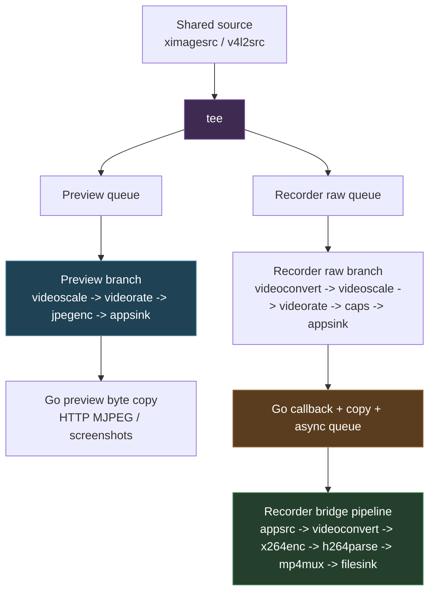
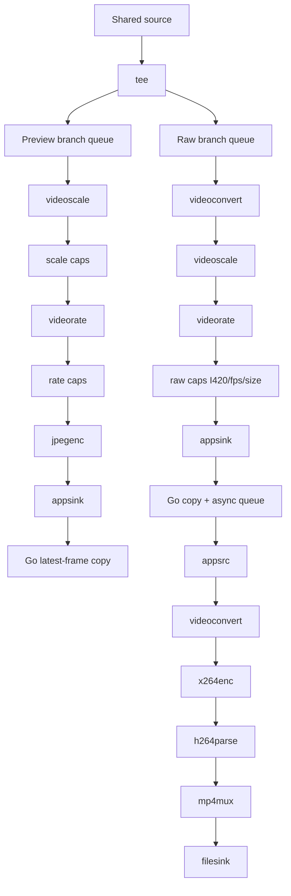

# Research Brief - Preview and Recording Performance Investigation Handoff

This note is a detailed handoff package for a researcher who will investigate and potentially fix the performance issue that appears when **previewing is added to the recording pipeline** in `screencast-studio`.

The short version is:

- The project has already been ported to a GStreamer-based shared capture architecture.
- Recorder-only performance is now reasonably well characterized.
- The biggest remaining performance spike is **not** idle server cost and **not** a stable recorder-only bridge mismatch.
- The most important remaining issue is the **combined preview + recorder case** on the same shared source.

This document is meant to be continuation-friendly. It explains the current runtime shape, the relevant GStreamer graphs, the benchmark history, the saved evidence, and the most useful next research questions.

> [!summary]
> 1. The current system uses a **shared source + tee** architecture with separate preview and recorder branches.
> 2. Recorder-only cost is now broadly aligned across direct GStreamer, the production-ish shared runtime, and a staged `appsink -> Go -> appsrc -> x264` bridge benchmark.
> 3. The remaining major cost spike is **preview + recorder together**: in the latest standalone interplay benchmark, recorder-only was about **94% avg CPU** while preview+recorder rose to about **188% avg CPU**.
> 4. Cheaper preview settings help somewhat, but they do **not** eliminate the spike, which suggests the interaction between the live preview branch and recorder branch is the main remaining optimization target.

## Why this research brief exists

There are now enough moving parts and enough saved experiments that the performance investigation can and should be handed off cleanly. The goal is not simply to summarize that “it is slow.” The goal is to preserve the entire current state of understanding in a form that lets another researcher continue without having to reconstruct the architecture or rerun every experiment blindly.

This brief therefore tries to answer four questions:

1. **What is the current runtime architecture?**
2. **What have we already measured?**
3. **What did those measurements change in our understanding?**
4. **What are the most promising next experiments or fixes?**

## Project and codebase context

Primary repository:

- `/home/manuel/code/wesen/2026-04-09--screencast-studio`

Primary ticket for the preview/regression/performance investigation:

- `/home/manuel/code/wesen/2026-04-09--screencast-studio/ttmp/2026/04/13/SCS-0014--fix-preview-regressions-in-screencast-studio-web-ui/`

Earlier related migration ticket:

- `/home/manuel/code/wesen/2026-04-09--screencast-studio/ttmp/2026/04/13/SCS-0012--gstreamer-migration-deep-analysis-experiments-and-intern-guide/`

### Current important source files

These are the most important implementation files for the current performance story:

- `pkg/media/gst/shared_video.go`
  - shared capture registry
  - shared preview consumer branch
  - shared source lifecycle
- `pkg/media/gst/shared_video_recording_bridge.go`
  - shared recorder raw consumer branch
  - Go-side sample handling
  - `appsrc` bridge recorder pipeline
- `pkg/media/gst/preview.go`
  - X11 source construction
  - region/window crop behavior
- `pkg/media/gst/recording.go`
  - runtime-level recording orchestration
- `internal/web/preview_manager.go`
  - preview lifecycle and reuse
- `ui/src/components/preview/PreviewStream.tsx`
  - frontend preview framing and aspect-ratio behavior
- `ui/src/pages/StudioPage.tsx`
  - source-aware preview aspect ratio metadata

## Current runtime setup

The project now uses a **shared GStreamer source** for preview and recording rather than the old preview suspend/restore handoff model.

Conceptually, the current runtime looks like this:



### Current preview branch

The preview branch is built in `pkg/media/gst/shared_video.go` by `buildSharedPreviewConsumer(...)`.

The important elements are:

- `queue` with `leaky=2`, `max-size-buffers=2`
- `videoscale`
- scale caps
- `videorate`
- FPS caps
- `jpegenc`
- `appsink`

Preview frames are then copied into Go and retained as the latest JPEG frame. That is important: this is not a pure in-pipeline preview sink. The production preview path really does perform JPEG byte-copy work in Go.

### Current recording branch

The recording branch is built across `pkg/media/gst/shared_video.go` and `pkg/media/gst/shared_video_recording_bridge.go`.

The current production-ish model is:

1. attach a raw consumer branch to the shared source,
2. normalize it to I420 / target size / target FPS,
3. pull frames through `appsink`,
4. copy buffers in Go,
5. queue them asynchronously,
6. push them into a second pipeline via `appsrc`,
7. encode with x264 and mux to file.

### Historical note: preview freeze fix

Earlier in the investigation, preview used to freeze during recording. That was traced to backpressure in the shared raw recording path, and the fix was to make the recorder bridge asynchronous so the shared source callback path would not block on encoding-side work.

That matters for any future optimization work: the current bridge shape is not just an arbitrary design. It exists partly because a more direct blocking path already produced a real preview freeze regression.

## The X11 / region-capture context

Most of the important performance experiments have been run against this specific source shape:

- display: `:0`
- root: `2880x1920`
- region: `0,960,2880,960`

In plain language, that is the **bottom half** of the full display.

This choice is not arbitrary. It came from earlier debugging of a correctness bug where bottom-half / right-half region previews sometimes looked like the full display. That debugging showed a key fact:

- on this machine, direct `ximagesrc` coordinate capture could produce the right dimensions while still showing the wrong full-display content,
- but full-root capture plus explicit `videocrop` produced a true crop.

So the current region/window runtime should be understood as:

```text
ximagesrc(full root) -> videocrop -> downstream branches
```

This is relevant for the performance story because it means all current bottom-half measurements happen **after** adopting the full-root + `videocrop` correctness fix. In other words: the measured performance is for the current correct region-capture model, not for an older unreliable coordinate-capture shortcut.

## The benchmark suite history

The most important saved benchmark families live under the SCS-0014 ticket `scripts/` tree.

### 06: Pure direct GStreamer benchmark

Path:

- `ttmp/2026/04/13/SCS-0014--fix-preview-regressions-in-screencast-studio-web-ui/scripts/06-gst-recording-performance-matrix/`

Purpose:

- measure pure `gst-launch-1.0` capture / preview-like JPEG / direct x264 recording cost
- no shared runtime, no Go bridge orchestration

Most important reconciled result directory:

- `.../results/20260413-233847/`

Headline numbers from that reconciled run:

- capture-to-fakesink: **25.83% avg CPU**
- preview-like-jpeg: **9.83% avg CPU**
- direct-record-current (`speed-preset=3`): **94.33% avg CPU**
- direct-record-ultrafast (`speed-preset=1`): **55.33% avg CPU**

Interpretation:

- x264 settings matter a lot
- direct recorder-only x264 cost is already substantial even before any shared runtime complexity

### 07: Production-ish shared runtime benchmark

Path:

- `ttmp/2026/04/13/SCS-0014--fix-preview-regressions-in-screencast-studio-web-ui/scripts/07-go-shared-recording-performance-matrix/`

Purpose:

- measure the project’s shared-runtime behavior more directly than pure `gst-launch`
- uses the repository’s preview/recording abstractions and shared-source runtime pieces

Important reconciled result directory:

- `.../results/20260413-233911/`

Headline numbers from the reconciled run:

- preview-only: **13.17% avg CPU**
- recorder-only: **94.00% avg CPU**
- preview-plus-recorder: **131.00% avg CPU**

Interpretation:

- recorder-only lines up closely with direct x264 and the staged bridge+x264 benchmark
- preview+recorder together is clearly more expensive than recorder-only

### 09: Staged bridge-overhead decomposition benchmark

Path:

- `ttmp/2026/04/13/SCS-0014--fix-preview-regressions-in-screencast-studio-web-ui/scripts/09-go-bridge-overhead-matrix/`

Purpose:

- isolate the cost of:
  - normalized raw baseline
  - `appsink` callback
  - Go `buffer.Copy()`
  - async queueing
  - `appsrc`
  - x264

Important reconciled result directory:

- `.../results/20260413-233935/`

Headline numbers:

- normalized-fakesink: **26.50% avg CPU**
- appsink-discard: **27.29% avg CPU**
- appsink-copy-discard: **32.67% avg CPU**
- appsink-copy-async-discard: **29.50% avg CPU**
- appsink-copy-async-appsrc-fakesink: **31.83% avg CPU**
- appsink-copy-async-appsrc-x264: **91.50% avg CPU**

Interpretation:

- the isolated Go/appsrc bridge path is not free,
- but it does **not** appear to be the main recorder-only mystery,
- because once x264 is introduced, the total aligns closely with both direct x264 and shared-runtime recorder-only.

### 11: Same-session reconciliation wrapper

Path:

- `ttmp/2026/04/13/SCS-0014--fix-preview-regressions-in-screencast-studio-web-ui/scripts/11-go-shared-vs-bridge-reconciliation-matrix/`

Purpose:

- rerun 06, 07, and 09 back-to-back in one session
- determine whether the earlier apparent mismatch was stable

Important result directory:

- `.../results/20260413-233847/`

Key reconciled numbers:

- 06 direct current x264: **94.33%**
- 07 shared-runtime recorder-only: **94.00%**
- 09 staged bridge+x264: **91.50%**
- 07 preview+recorder: **131.00%**

Interpretation:

- the earlier giant recorder-only mismatch did **not** hold up under same-session comparison
- the more credible current remaining performance problem is the **combined preview + recorder case**

### 12: Preview/recorder interplay benchmark

Path:

- `ttmp/2026/04/13/SCS-0014--fix-preview-regressions-in-screencast-studio-web-ui/scripts/12-go-preview-recorder-interplay-matrix/`

Purpose:

- focus directly on the combined preview + recorder case
- include a more production-like preview branch that really JPEG-encodes and copies bytes into Go
- compare current preview settings versus a cheaper preview profile while recording

Important result directory:

- `.../results/20260414-070646/`

Headline numbers:

- preview-only: **12.17% avg CPU**
- recorder-only: **94.00% avg CPU**
- current preview + recorder: **188.43% avg CPU**
- cheap preview + recorder: **170.00% avg CPU**

Additional useful counters:

- preview-only copied about **17.3 MB** of JPEG bytes in 6 seconds
- current preview + recorder copied about **17.6 MB** while still pushing **144** recorder frames
- cheap preview + recorder reduced preview byte-copy load dramatically to about **1.6 MB**, but total CPU was still **170% avg**

Interpretation:

- this is now the strongest current finding
- preview+recorder is far more expensive than recorder-only
- cheaper preview settings help only partially
- the problem is not explained solely by JPEG byte-copy volume

## Current best interpretation

The current evidence supports the following hierarchy of confidence.

### High-confidence statements

1. **Recorder-only cost is real and substantial.**
   - Around 94% avg CPU for the tested `2880x960 @ 24 fps` region with current x264 settings.

2. **x264 settings matter a lot.**
   - The direct ultrafast test is much cheaper than the current preset.

3. **Recorder-only cost is broadly aligned across the three key benchmark families.**
   - Direct x264, staged bridge+x264, and shared-runtime recorder-only are all in the same rough range.

4. **The combined preview + recorder case is the clearest remaining big spike.**
   - The latest interplay benchmark shows ~188% avg CPU with current preview settings.

5. **Cheaper preview helps but does not solve the problem.**
   - Going to a cheaper preview profile reduced total CPU somewhat, but not nearly enough.

### Medium-confidence statements

1. Some of the extra combined cost likely comes from duplicated work across two active downstream branches from the same shared source.
2. The relevant duplicated work probably includes some combination of:
   - scaling,
   - rate conversion,
   - color conversion,
   - JPEG encoding,
   - scheduling/branch contention,
   - and source/tee fanout costs.

3. The preview branch likely becomes a more serious problem at larger region sizes even if its own isolated CPU number looks small, because it interacts badly with the recorder branch rather than just adding linearly.

### Lower-confidence / still-open statements

1. We do **not yet** know the single dominant micro-cause of the combined spike.
2. We do **not yet** know whether the best fix is:
   - degrading preview while recording,
   - restructuring where transforms happen,
   - sharing more work before branch split,
   - or partially suspending preview work.

## Production graph vs benchmark graph

The researcher should be aware that the benchmarks are deliberately simplified tools, not perfect replicas of every production detail. The key question is whether they preserve the right expensive behaviors.

### Production-ish graph



### Interplay benchmark graph

The `12-go-preview-recorder-interplay-matrix` intentionally mirrors this shape more closely than the earlier staged bridge-only benchmark. It includes:

- a shared source
- a tee
- a real preview branch with JPEG encode and Go-side byte copy
- a real recorder raw branch with Go-side copy + async queue + `appsrc -> x264`

That is why the interplay benchmark is currently the most interesting one for ongoing research.

## Suggested researcher questions

Here are the questions we most want answered next.

### 1. Where is the non-linear combined cost actually coming from?

The key issue is not simply “preview costs 12% and recorder costs 94%.” The combined case is much worse than that. That means something about the two active branches together is amplifying cost.

Sub-questions:

- Is the source/tee fanout itself expensive under load?
- Are scale / rate / convert stages duplicated in a way that could be shared upstream?
- Is one branch causing the other to negotiate or schedule badly?
- Is there cache/memory-bandwidth contention due to both branches operating on large frames simultaneously?

### 2. Should preview automatically degrade while recording?

This is the most product-plausible mitigation path.

Questions:

- If preview drops to very low fps / width / quality while recording, does CPU become acceptable?
- Is there a “good enough” preview profile for recording mode that preserves UX without burning too much CPU?
- Should preview become screenshot-oriented during recording instead of continuous MJPEG?

### 3. Can transforms be shared earlier?

Right now preview and recorder diverge into separate branches that each do their own transforms.

Questions:

- Can some conversion or scaling happen once before the split?
- Would that help both branches, or would it compromise recording quality too much?
- Is there a sensible intermediate format/shape that both preview and recorder can consume efficiently?

### 4. Is there a different preview sink strategy that reduces combined cost?

Right now preview is effectively:

```text
raw video -> jpegenc -> appsink -> Go byte copy -> HTTP MJPEG
```

Questions:

- Is MJPEG itself the wrong preview format for the combined case?
- Is there a lower-overhead live preview strategy that still works for the current web UI seam?
- Could preview be sampled rather than continuously generated while recording?

## Suggested experimental plan for the researcher

This is the continuation plan I would recommend.

### Phase 1: Extend the interplay benchmark, not production code first

Use `12-go-preview-recorder-interplay-matrix` as the main experimental base.

Add more cases such as:

- preview disabled after warmup
- preview fps sweep: `10`, `5`, `2`, `1`
- preview width sweep: `1280`, `960`, `640`, `320`
- preview quality sweep: `80`, `60`, `40`, `20`
- preview branch without Go byte copy if possible
- preview branch without JPEG encode if possible, to isolate JPEG vs downstream Go cost

### Phase 2: Compare branch transform placement

Build benchmark variants that test:

- current branch-local scaling/conversion
- partially shared conversion before `tee`
- alternate preview scaling locations

The goal is not to land a final architecture immediately, but to identify whether duplicated transform work is the main amplifier.

### Phase 3: Evaluate mitigation strategies

Once the benchmark makes the culprit clearer, test product-plausible mitigations such as:

- automatic cheap preview profile while recording
- “pause preview while recording” mode
- very low-fps live preview while recording
- on-demand screenshot preview while recording

## Constraints and non-goals

The researcher should keep these constraints in mind.

### Do not regress the preview-freeze fix lightly

The current bridge design exists partly because earlier more direct behavior caused preview freezes during recording. Any optimization that simplifies the bridge or changes backpressure behavior should be tested against that known failure mode.

### Do not abandon the region correctness fix accidentally

The current performance measurements for region capture use the **corrected** full-root + `videocrop` model. Avoid switching back to direct `ximagesrc` coordinate capture as a “performance shortcut” without re-proving correctness on this machine.

### Avoid guessing from only one benchmark family

The ticket now has multiple complementary suites precisely because one family alone can be misleading.

## Reproduction commands

Repo root:

```bash
cd /home/manuel/code/wesen/2026-04-09--screencast-studio
```

### Rerun the reconciled benchmark families

```bash
bash ttmp/2026/04/13/SCS-0014--fix-preview-regressions-in-screencast-studio-web-ui/scripts/11-go-shared-vs-bridge-reconciliation-matrix/run.sh
```

### Rerun the staged bridge decomposition benchmark

```bash
bash ttmp/2026/04/13/SCS-0014--fix-preview-regressions-in-screencast-studio-web-ui/scripts/09-go-bridge-overhead-matrix/run.sh
```

### Rerun the preview/recorder interplay benchmark

```bash
bash ttmp/2026/04/13/SCS-0014--fix-preview-regressions-in-screencast-studio-web-ui/scripts/12-go-preview-recorder-interplay-matrix/run.sh
```

## Useful commit anchors

Recent benchmark-related commits in the repo:

- `1741823b6b14cafaba7e72c508271ec8e54fb1a7` — `Add standalone bridge overhead benchmarks`
- `e1b88eb84f35dc64d668bab9463d216baadb4f2b` — `Record reconciled GStreamer performance findings`
- `8be7bee780c821647295664e1abf8eac97ddc665` — `Add preview recorder interplay benchmarks`
- `5f4ae2b5ea62b35e6ee7f558296cc75e650b128d` — `Record preview and recorder interplay findings`

## Handoff conclusion

The current best handoff message is:

> The project no longer appears blocked on recorder-only uncertainty. The most promising next research direction is the **interaction of the preview branch with the recording branch on the shared source**.

In other words:

- x264 is expensive, yes,
- but the largest remaining unexplained and product-relevant spike is the **combined live preview + recording case**,
- and that is where the researcher’s effort is most likely to pay off.
