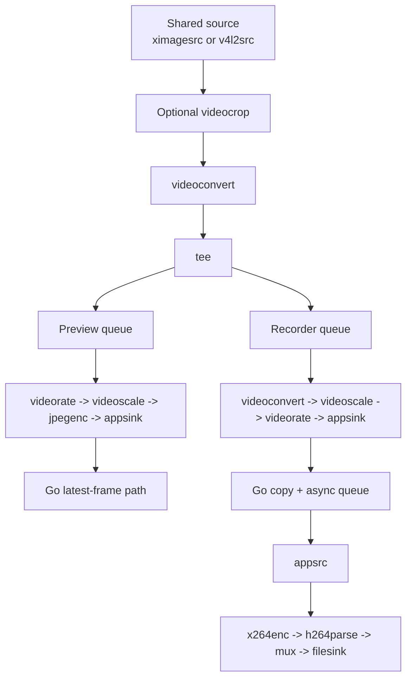

# Preview and recording performance improvement report

## Executive summary

The current `screencast-studio` runtime uses a shared capture source with a `tee`, then fans out into two independent downstream branches: one branch produces live web preview JPEGs, and the other branch produces raw frames for a Go-managed `appsink -> appsrc -> x264 -> mp4` recording path. The attached handoff brief already established the most important empirical fact: recorder-only cost is real but broadly understood, while the largest remaining unexplained spike is the **combined preview + recorder case**.

The code changes in this workspace do not try to solve the entire architectural problem in one jump. They implement a focused mitigation aimed at the most actionable sources of wasted work inside the preview branch:

1. preview is now **automatically constrained while a recorder raw consumer is active on the same shared source**, and
2. the preview branch now applies **`videorate` before `videoscale` and `jpegenc`**, so frames that will be dropped for preview cadence are dropped earlier instead of being scaled first.

Those two changes are deliberately conservative. They do not remove the shared-source design, they do not undo the full-root-plus-`videocrop` correctness fix, and they do not regress the asynchronous recorder bridge that fixed the earlier preview-freeze problem. They are meant to reduce avoidable preview-side work while preserving the current product shape.

## What problem this report addresses

The measured problem is not “recording is expensive.” Recording is expensive, but the benchmark history shows that this is already largely explained by `x264` at the tested `2880x960 @ 24 fps` workload. The sharper problem is that **preview + recorder together cost far more CPU than recorder-only**.

That difference matters because it changes the engineering question. Once recorder-only aligned across the direct GStreamer run, the staged bridge benchmark, and the shared runtime, the remaining question became: **what extra work is preview causing when it runs beside recording on the same capture source?**

## Fundamentals: what is actually happening in this system

### 1. Capture is not “just reading pixels”

For display, region, and window sources, the runtime builds on `ximagesrc`. On this machine, the trustworthy region/window path is not direct coordinate capture. It is:

```text
ximagesrc(full root) -> videocrop -> downstream processing
```

That means the source is first capturing the full X11 root image and only then cropping to the requested rectangle. This matters for both correctness and cost.

Correctness matters because earlier debugging showed that direct coordinate capture could return the right dimensions while still showing the wrong image content. Cost matters because full-root capture plus crop means there is already substantial work happening before the pipeline even reaches the preview and recorder split.

For camera sources, the pipeline starts from `v4l2src`, which has a different capture path but then enters the same general downstream world of raw frames, color conversion, scaling, rate control, and encoding.

### 2. A `tee` does not magically make downstream work free

A `tee` duplicates a live stream into multiple branches. That is exactly what makes simultaneous preview and recording possible, but it does not mean the second branch is cheap. Every active branch still consumes scheduling budget, buffer movement, caps negotiation, and downstream processing time.

A simplified picture of the production-ish runtime is:



The key detail is where work happens relative to the split. Anything before the `tee` is shared by both consumers. Anything after the `tee` is duplicated branch work.

### 3. `queue`, `leaky`, and `max-size-buffers` control backpressure, not total CPU

Both preview and raw recorder branches use `queue` with leaky settings. That is good because it prevents a slow branch from blocking the shared source indefinitely. It is one reason the earlier preview-freeze regression could be fixed.

But leakiness only answers one question: **what happens when a branch falls behind?** It does not answer the other question: **how much work did the branch do before it decided to drop or before the queue overflowed?**

This distinction matters here. A preview branch can still burn CPU on conversion, scaling, rate control, and JPEG encode even if it is configured to drop excess buffers under pressure.

### 4. `videorate`, `videoscale`, and `jpegenc` each attack different dimensions of cost

- `videorate` controls how many frames per second a downstream branch tries to keep.
- `videoscale` changes the spatial size of the frame.
- `jpegenc` compresses the frame into a JPEG byte stream for preview delivery.

These stages are not interchangeable. Their order matters.

If the branch is ordered like this:

```text
videoscale -> videorate -> jpegenc
```

then every incoming frame is first resized and only afterwards reduced to the preview target frame rate.

If the branch is ordered like this:

```text
videorate -> videoscale -> jpegenc
```

then the branch first throws away frames it does not intend to keep and only scales and JPEG-encodes the survivors.

For a source running around 24 fps with a preview target of 10 fps or 4 fps, that difference is material. Rate-limiting first means fewer frames visit the expensive scale and JPEG stages.

### 5. The preview path is not only a GStreamer problem; it is also a Go memory-copy problem

The preview output is not rendered directly inside the pipeline. It goes through `appsink`, then into Go, then into web-serving state. That means preview cost includes:

1. raw-frame processing inside GStreamer,
2. JPEG compression inside GStreamer,
3. delivery of the encoded JPEG buffer into `appsink`,
4. Go-side handling of the frame bytes,
5. HTTP multipart MJPEG delivery to the browser.

This is important because it explains why preview cannot be judged only by the apparent simplicity of the preview branch. Once a live preview leaves the pipeline and enters application memory, copy cost and scheduling overhead become part of the story.

### 6. The recorder path is expensive for reasons that are partly unavoidable

The recorder path normalizes frames to raw `I420`, copies them through Go, re-injects them into a second pipeline through `appsrc`, and then compresses them with `x264` before muxing to MP4.

A simplified mental model is:

```text
raw frames -> copy -> queue -> appsrc -> x264 -> h264parse -> mp4mux -> disk
```

The handoff measurements already show that once `x264` is in the loop, CPU rises sharply. That is normal. Video encoding is computationally heavy, especially at the region sizes used in the benchmarks.

The engineering opportunity is therefore not “make H.264 free.” It is “avoid wasting additional CPU in the preview path while H.264 is already consuming a full core.”

## Why cheap preview settings helped only partially in the earlier benchmark

This is the most important interpretive point in the whole report.

The handoff benchmark showed that a cheaper preview profile reduced preview byte-copy volume dramatically, but total CPU only fell partway. That result makes sense once you look at where the work happens.

A cheaper preview profile can reduce:

- output width,
- preview FPS,
- JPEG quality,
- and Go-side preview byte volume.

But if the preview branch still receives full-resolution incoming frames from the shared `tee`, and if it still scales frames **before** rate limiting, then a large amount of preview-side work still happens even though the final preview output is smaller.

In other words, cheaper preview settings help, but they do not fully solve the problem because they do not change the deeper fact that the preview branch is still a live second consumer of the shared source.

## Root-cause analysis from the code review

After reading the shared-source and bridge code, I came away with four practical conclusions.

### 1. The combined spike is structurally plausible

The architecture asks one capture source to satisfy two very different consumers simultaneously:

- a low-latency preview consumer that wants regular JPEGs for a browser, and
- a recorder consumer that wants continuous raw frames headed toward H.264 encoding.

That is not a pathological design, but it is a design where duplicate downstream work is easy to accumulate.

### 2. The preview branch was doing avoidable work in the wrong order

Before the change, the preview branch in `pkg/media/gst/shared_video.go` was effectively:

```text
queue -> videoscale -> caps(width/height) -> videorate -> caps(fps) -> jpegenc -> appsink
```

That means preview was scaling frames before deciding which frames it even wanted to keep.

### 3. Preview did not adapt when recording became active

The preview profile logic existed, but it was static. A preview attached to a shared source kept the same width, FPS, and JPEG quality whether it was alone or whether a recorder was also attached.

Given the benchmark evidence, that is leaving a useful mitigation on the table.

### 4. The current architecture still leaves larger future gains available

Even after the mitigation, the architecture still has obvious remaining costs:

- preview and recorder still remain separate consumers after the `tee`,
- preview still leaves the pipeline through `appsink` and enters Go memory,
- recorder still uses the `appsink -> Go -> appsrc` bridge,
- and the upstream capture path still has to serve both consumers.

So this change is best understood as a **targeted mitigation**, not a final architecture.

## What I changed

### Change 1: preview now uses a recording-constrained profile while recording is active

I added dynamic profile selection to the shared-source runtime. The shared source now computes the desired preview profile based on whether any raw recorder consumer is active.

The important behavior change is:

- when no recorder raw consumer is attached, preview keeps the normal profile,
- when a recorder raw consumer is attached, preview switches to a constrained profile,
- when the recorder raw consumer detaches, preview switches back.

The current constrained values are:

- for display/window/region sources: `max width 640`, `4 fps`, `jpeg quality 50`
- for camera sources: `max width 960`, `6 fps`, `jpeg quality 70`

These values are not magical. They are a conservative starting point chosen to preserve a useful live preview while materially reducing work.

### Change 2: the preview branch now rate-limits before scaling and JPEG encode

The preview branch now builds as:

```text
queue -> videorate -> fps caps -> videoscale -> size caps -> jpegenc -> appsink
```

That is the most direct improvement in the actual media graph.

The goal is simple: if preview only needs 4 or 10 fps, do not scale and JPEG-encode the extra frames first.

### Change 3: raw consumer attach and detach now rebalance preview consumers

The shared source now re-applies preview profiles when recorder raw consumers attach or detach. This is the mechanism that turns the static profile into a dynamic one.

Operationally, that means a preview that was already running before recording started does not have to be destroyed and recreated. Its caps and JPEG settings are adjusted in place.

### Change 4: the interplay benchmark now includes an adaptive scenario

I extended `scripts/12-go-preview-recorder-interplay-matrix/` so it can run an additional scenario that mirrors the mitigation strategy:

- constrained preview profile, and
- rate-first preview branch ordering.

This matters because the easiest next validation step on the real capture machine is to compare:

- current preview + recorder,
- cheap preview + recorder,
- adaptive preview + recorder.

## Why I chose this mitigation instead of a more radical rewrite

The repo history and handoff constraints rule out several attractive-but-risky moves.

### I did not remove the asynchronous recorder bridge

That bridge exists because a more direct path previously caused preview freezes. Any optimization that simplifies the bridge must be tested against that known failure mode.

### I did not switch region capture back to direct X11 coordinates

That would have been the wrong optimization. The current full-root-plus-`videocrop` approach exists because it restored correctness on this machine.

### I did not turn preview into a screenshot-only mode by default

That may still be a valid product option, but it is a larger UX decision. The implemented change keeps the current product promise of “continuous preview,” just at a more economical profile while recording is active.

## Expected impact

The expected gains come from two places.

First, the constrained recording-time preview profile reduces the amount of preview work the system asks for at all. Fewer pixels, fewer frames, and lower JPEG quality all help.

Second, the rate-first branch ordering ensures that the preview work that remains is spent on frames that will actually survive to preview output.

I do **not** expect this alone to erase the entire preview+recording spike. The architecture still contains duplicate branch work and recorder bridge cost. But I do expect it to reduce avoidable preview-side CPU and make the combined case less wasteful.

## Validation performed in this workspace

### What I could validate

- `gofmt -w` ran successfully on the modified Go files.
- `bash -n` passed for the updated interplay benchmark runner script.
- A patch was generated successfully against the uploaded zip snapshot.

### What I could not fully validate here

I could not run the full Go test suite or the live capture benchmark in this environment.

The blockers were concrete:

1. the uploaded workspace is a zip snapshot without `.git` metadata or a ready local toolchain for the `go 1.25.5` requirement, and
2. even after relaxing the version in a throwaway copy, `go test` stopped immediately because the snapshot does not include the required `go.sum` entries and the environment cannot reach the Go module proxy.

The exact test failure captured during validation was:

```text
pkg/media/gst/bus.go:6:2: missing go.sum entry for module providing package github.com/go-gst/go-glib/glib
pkg/media/gst/bus.go:7:2: missing go.sum entry for module providing package github.com/go-gst/go-gst/gst
pkg/media/gst/shared_video.go:13:2: missing go.sum entry for module providing package github.com/go-gst/go-gst/gst/app
pkg/media/gst/preview.go:12:2: missing go.sum entry for module providing package github.com/pkg/errors
pkg/media/gst/preview.go:13:2: missing go.sum entry for module providing package github.com/rs/zerolog/log
pkg/dsl/load.go:9:2: missing go.sum entry for module providing package gopkg.in/yaml.v3
```

That means the code change is reasoned and syntax-formatted, but its runtime performance still needs to be measured on the real capture machine.

## Recommended validation on the real machine

Run the updated interplay benchmark and compare these cases side by side:

```bash
bash ttmp/2026/04/13/SCS-0014--fix-preview-regressions-in-screencast-studio-web-ui/scripts/12-go-preview-recorder-interplay-matrix/run.sh
```

The new scenario to inspect is:

```text
preview-adaptive-plus-recorder
```

The minimum useful comparison is:

- `preview-current-plus-recorder`
- `preview-cheap-plus-recorder`
- `preview-adaptive-plus-recorder`

Questions to answer during that run:

1. Does the adaptive scenario beat the current profile by a meaningful margin?
2. Does rate-first ordering help beyond the old cheap-preview scenario?
3. Is the resulting preview still good enough during recording?
4. Does switching profiles at recorder start/stop behave cleanly in the real web UI?

## What remains open after this mitigation

This change addresses wasted preview work, but it does not eliminate the deeper architectural costs.

The most promising future directions still look like this:

### 1. Share more work before the split

If preview and recorder can share some conversion or normalization work before the `tee`, total duplicated branch cost may fall.

### 2. Collapse preview onto recorder-derived frames while recording

A more radical but compelling option is to avoid a separate live preview branch during recording and derive preview from the recorder feed at a low cadence.

### 3. Reduce application-layer copies in the preview path

The preview path still has Go-side frame retention and HTTP MJPEG delivery costs. There is probably further savings available there.

### 4. Revisit recorder encoder tuning explicitly

The existing benchmark history already shows that `x264` preset choice materially affects CPU. That remains a separate but still valuable tuning axis.

## Bottom line

The combined preview + recorder spike is best understood as a **pipeline-shape problem**, not as a mystery bug.

The implemented mitigation improves that shape in two practical ways:

- it makes preview cheaper while recording is active, and
- it makes preview spend its remaining work on fewer frames by rate-limiting before scaling and JPEG encode.

That should reduce wasted CPU without regressing the two big constraints already established by the investigation: keep the asynchronous recorder bridge that avoids preview freezes, and keep the full-root-plus-`videocrop` region path that preserves correctness.
